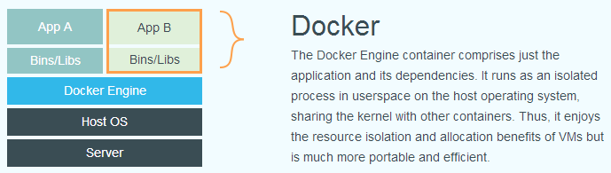

## 什么是 Docker 容器？

### 1. 启动一个 nginx 服务容器看看

```shell
# docker run -d ubuntu/nginx:latest
# ubuntu是镜像仓库的地址
# nginx这个镜像的名字
# latest镜像版本版本

```

### 2. 自己来做一个 nginx 的镜像

```shell
# cd ./nginx/
# cat Dockerfile
FROM ubuntu:impish
RUN apt update && apt-get install -y nginx
COPY file1 /var/www/html/
ADD  file2.tar.gz /var/www/html/
EXPOSE 80
CMD ["/usr/sbin/nginx", "-g", "daemon off;"]
# 它提供了容器中程序执行需要的所有文件

# docker build -t registry/nginx:v1 -f ./Dockerfile .

# docker images
REPOSITORY       TAG       IMAGE ID       CREATED          SIZE
registry/nginx   v1        e667596cdbd0   28 seconds ago   166MB
ubuntu/nginx     latest    f85d50b56ddd   4 months ago     139MB
ubuntu           impish    2dc51e04d744   6 months ago     77.4MB
```

### 3. 用自己做的 nginx 镜像启动一个容器

```shell
# docker run -d registry/nginx:v1

# docker ps
CONTAINER ID   IMAGE               COMMAND                  CREATED          STATUS          PORTS     NAMES
16983ef602cf   registry/nginx:v1   "/usr/sbin/nginx -g …"   15 seconds ago   Up 14 seconds   80/tcp    elastic_wescoff
```

### 4. 测试一下容器是不是正常工作

- 进入容器中查看 nginx 服务是不是启动了，配置文件是否正确
- 在容器外部使用 curl 测试下载文件

```shell
# docker exec 16983ef602cf ps -ef
UID          PID    PPID  C STIME TTY          TIME CMD
root           1       0  0 13:25 ?        00:00:00 nginx: master process nginx -g daemon off;
www-data       7       1  0 13:25 ?        00:00:00 nginx: worker process
www-data       8       1  0 13:25 ?        00:00:00 nginx: worker process
root          23       0  0 13:34 ?        00:00:00 ps -ef

# docker exec 16983ef602cf ls /var/www/html
file1
file2

# docker exec 16983ef602cf ip addr
1: lo: <LOOPBACK,UP,LOWER_UP> mtu 65536 qdisc noqueue state UNKNOWN group default qlen 1000

    link/loopback 00:00:00:00:00:00 brd 00:00:00:00:00:00

    inet 127.0.0.1/8 scope host lo

       valid_lft forever preferred_lft forever

168: eth0@if169: <BROADCAST,MULTICAST,UP,LOWER_UP> mtu 1500 qdisc noqueue state UP group default

    link/ether 02:42:ac:11:00:02 brd ff:ff:ff:ff:ff:ff link-netnsid 0

    inet 172.17.0.2/16 brd 172.17.255.255 scope global eth0

       valid_lft forever preferred_lft forever

# curl -L -O http://172.17.0.2/file2
  % Total    % Received % Xferd  Average Speed   Time    Time     Time  Current
                                 Dload  Upload   Total   Spent    Left  Speed
  0     0    0     0    0     0      0      0 --:--:-- --:--:-- --:--:--     0

# ls
file2
```

通过这上面的这些操作，估计你已经初步感知到，容器的文件系统是独立的，运行的进程环境是独立的，网络的设置也是独立的.

**_让进程在一个资源可控的独立环境运行，这就是容器_**

### 5. 容器的优点

虚拟机运行状态


容器运行状态



## 作业

1. 查一下 docker command：

   1. 已经推出但为被关闭的容器
   2. 进入正在运行的容器
   3. 查看容进程在操作系统的 Pid

2. 将自己负责的业务应用容器化

   1. 考虑镜像大小
   2. 使用多阶段构建
   3. 将 Dockerfile 和业务应用代码存放在一起
   4. 业务容器 init 进程需要能够处理 SIGTERM 信号（kill）

3. 将自己负责人业务容器镜像推送到，Hatbor 镜像仓库（必做）
