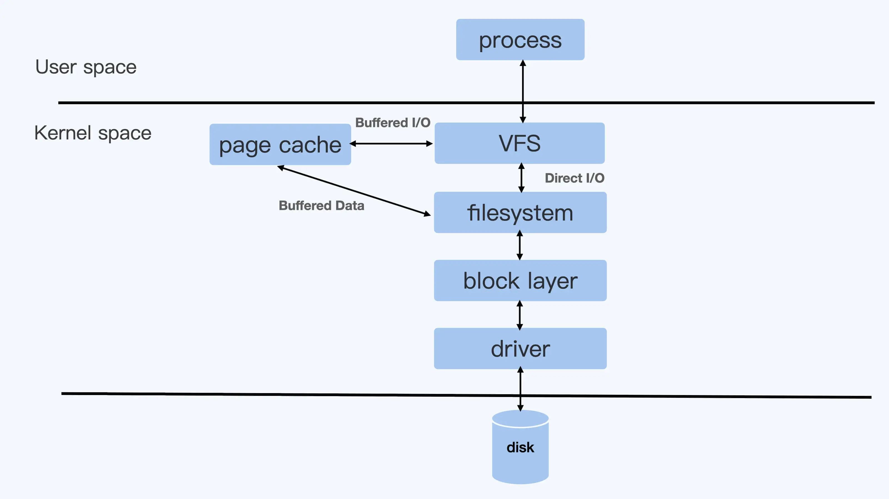
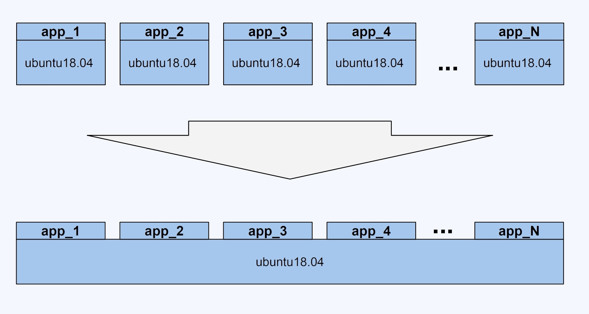
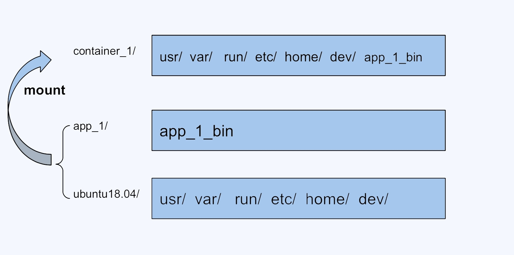
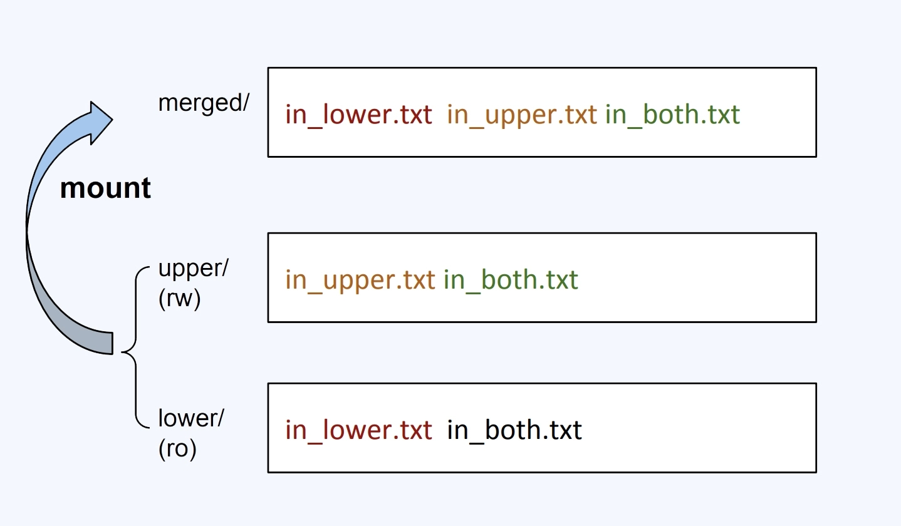

## 容器的底层技术

### 1. Namespace

Linux 系统 1 号进程时 systemd，进程是树状的，根进程是 systemd，进程都是由父进程 fork、clone 出来的

```shell
# ps -ef
UID          PID    PPID  C STIME TTY          TIME CMD
root           1       0  0 May13 ?        00:01:37 /sbin/init
root           2       0  0 May13 ?        00:00:00 [kthreadd]
...
root      253893  253863  0 08:06 ?        00:00:00 nginx: master process /usr/sbin/nginx -g daemon off;
www-data  253928  253893  0 08:06 ?        00:00:00 nginx: worker process
www-data  253929  253893  0 08:06 ?        00:00:00 nginx: worker process
```

在进程被 clone 出来的时候，数据结构中会指定进程的 Namespace


```shell
# docker exec 16983ef602cf ps -ef
UID          PID    PPID  C STIME TTY          TIME CMD
root           1       0  0 08:06 ?        00:00:00 nginx: master process /usr/sbin/nginx -g daemon off;
www-data       7       1  0 08:06 ?        00:00:00 nginx: worker process
www-data       8       1  0 08:06 ?        00:00:00 nginx: worker process
root          21       0  0 08:09 ?        00:00:00 ps -ef


# ps -ef | grep nginx
UID        PID  PPID  C STIME TTY          TIME CMD
root      253893  253863  0 08:06 ?        00:00:00 nginx: master process /usr/sbin/nginx -g daemon off;
www-data  253928  253893  0 08:06 ?        00:00:00 nginx: worker process
www-data  253929  253893  0 08:06 ?        00:00:00 nginx: worker process
root      254370  247230  0 08:09 pts/1    00:00:00 grep --color=auto nginx

```

HOST PID Namespace -> CONTAINER PID Namespace 不一样，有对应关系

```text
253893 -> 1
253928 -> 7
253929 -> 8
```

除了 PID namespace 外还有：UTS USR Mount Network IPC


对 Namespace 的操作

### 查看当前操作系统的 Namspace

```shell
# lsns -t net
        NS TYPE NPROCS    PID USER    NETNSID NSFS                           COMMAND
4026531992 net     111      1 root unassigned                                /sbin/init
4026532191 net       1    534 root unassigned                                /usr/sbin/haveged --Foreground --verbose=1 -w 1024
4026532257 net       3 253893 root          0 /run/docker/netns/fbcce4656316 nginx: master process /usr/sbin/nginx -g daemon off;
```

### 查看某进程的 Namespace

```shell
# ls -la /proc/253893/ns/
total 0
dr-x--x--x 2 root root 0 May 14 08:06 .
dr-xr-xr-x 9 root root 0 May 14 08:06 ..
lrwxrwxrwx 1 root root 0 May 14 09:17 cgroup -> 'cgroup:[4026531835]'
lrwxrwxrwx 1 root root 0 May 14 08:07 ipc -> 'ipc:[4026532254]'
lrwxrwxrwx 1 root root 0 May 14 08:07 mnt -> 'mnt:[4026532252]'
lrwxrwxrwx 1 root root 0 May 14 08:06 net -> 'net:[4026532257]'
lrwxrwxrwx 1 root root 0 May 14 08:07 pid -> 'pid:[4026532255]'
lrwxrwxrwx 1 root root 0 May 14 09:27 pid_for_children -> 'pid:[4026532255]'
lrwxrwxrwx 1 root root 0 May 14 09:17 user -> 'user:[4026531837]'
lrwxrwxrwx 1 root root 0 May 14 08:07 uts -> 'uts:[4026532253]'
```

### 进入某 Namespace 执行命令

```shell
# nsenter -t 253893 -n ip add
1: lo: <LOOPBACK,UP,LOWER_UP> mtu 65536 qdisc noqueue state UNKNOWN group default qlen 1000
    link/loopback 00:00:00:00:00:00 brd 00:00:00:00:00:00
    inet 127.0.0.1/8 scope host lo
       valid_lft forever preferred_lft forever
23: eth0@if24: <BROADCAST,MULTICAST,UP,LOWER_UP> mtu 1500 qdisc noqueue state UP group default
    link/ether 02:42:ac:11:00:02 brd ff:ff:ff:ff:ff:ff link-netnsid 0
    inet 172.17.0.2/16 brd 172.17.255.255 scope global eth0
       valid_lft forever preferred_lft forever
```

### Namespace 练习


2. Cgroup

Namaspace 解决进程之间的隔离，Cgroup 用于解决进程资源的限制


内核会把 Cgroup 子系统挂载到/sys/fs/cgroup 下

### CPU subsystem

```text
cpu.shares：在满载的情况下，配置Cgroup下进程CPU使用时间的相对值
cpu.cfs_period_us：配置Cgroup下进程CPU时间周期长度，单位us
cpu.cfs_quota_us：配置Cgroup下进程CPU最大使用时间，单位us
例如：
1. CGroup A：cpu.cfs_quota_us=50000，cfs_period_us=100000，那么Cgroup A最大可以使用50000/100000=0.5个CPU，即最大CPU使用率是50%
2. Cgroup A：cpu.shares=2048，Cgroup B：cpu.shares=1024，那么在主机满载情况下，Cgroup A最大可以使用2/3的CPU，Cgroup B最大可以使用1/3的CPU
```

Cgroup CPU 子系统练习：


### Memory subsystem

```text
memory.usage_in_bytes：配置Cgroup下进程使用内存的值
memory.max_usage_in_bytes：配置Cgroup下进程使用内存的最大值
memory.limit_in_bytes：配置Cgroup下进程最多使用内存的值，-1不限制
memory.oom_control：配置在Cgroup下是否使用OOM Killer，当Cgroup下进程内存使用超过最大值时，会触发OOM Kill
```

Cgroup Memory 子系统练习：


### Blkio subsystem

```text
blkio.throttle.read_iops_device：Cgroup下进程磁盘读取IOPS限制
blkio.throttle.read_bps_device：Cgroup下进程磁盘读取吞吐量限制
blkio.throttle.write_iops_device：Cgroup下进程磁盘写入IOPS限制
blkio.throttle.write_bps_device：Cgroup下进程磁盘写入吞吐量限制
```

Blkio Cgroup 参数配置:

```shell
echo "252:16 10485760" > $CGROUP_CONTAINER_PATH/blkio.throttle.write_bps_device
# 256是主设备号，16是次设备号
```

额外说明：

Direct I/O 和 Buffered I/O



在 Linux 里，由于考虑到性能问题，绝大多数的应用都会使用 Buffered I/O 模式

3. Union FS

想象一下，假设如果我们 100 个镜像，每个 java 镜像 500M，如何存储和传输这些镜像最好？



这就是 Union FS，那 Union FS 是如何工作的呢？



在容器内执行 df-h 可以看到是通过 OverlayFS 实现：



OverlayFS 练习

```shell

mkdir upper lower merged work
echo "I'm from lower!" > lower/in_lower.txt
echo "I'm from upper!" > upper/in_upper.txt
# `in_both` is in both directories
echo "I'm from lower!" > lower/in_both.txt
echo "I'm from upper!" > upper/in_both.txt

sudo mount -t overlay overlay \
 -o lowerdir=./lower,upperdir=./upper,workdir=./work \
 ./merged


```

执行完目录结构为：

```shell
# tree -h
.
├── [4.0K]  lower
│   ├── [  16]  in_both.txt
│   └── [  16]  in_lower.txt
├── [4.0K]  merged
│   ├── [  16]  in_both.txt
│   ├── [  16]  in_lower.txt
│   └── [  16]  in_upper.txt
├── [4.0K]  upper
│   ├── [  16]  in_both.txt
│   └── [  16]  in_upper.txt
└── [4.0K]  work
    └── [4.0K]  work

# cat merged/in_both.txt
I'm from upper!
```

- lower 目录是底层的目录，只读的
- upper 目录是上层的目录，可读写的
- merged 目录是挂在后展示给用户的目录
- work 目录是挂载中间文件产生的目录

模拟用户操作：

第一，新建文件

```shell
# touch merged/newadd.txt
# tree -h
.
├── [4.0K]  lower
│   ├── [  16]  in_both.txt
│   └── [  16]  in_lower.txt
├── [4.0K]  merged
│   ├── [  16]  in_both.txt
│   ├── [  16]  in_lower.txt
│   ├── [  16]  in_upper.txt
│   └── [   0]  newadd.txt
├── [4.0K]  upper
│   ├── [  16]  in_both.txt
│   ├── [  16]  in_upper.txt
│   └── [   0]  newadd.txt
└── [4.0K]  work
    └── [4.0K]  work

5 directories, 9 files
```

这个文件会出现在 upper/ 目录中

第二，删除文件：

删除 in_upper.txt 文件

```shell
# rm -rf merged/in_upper.txt
# ll upper/
total 12
drwxr-xr-x 2 root root 4096 May 21 18:32 ./
drwxr-xr-x 6 root root 4096 May 21 18:14 ../
-rw-r--r-- 1 root root   16 May 21 18:13 in_both.txt
-rw-r--r-- 1 root root    0 May 21 18:26 newadd.txt
```

这个文件会在 upper/ 目录中消失

删除 in_lower.txt 文件

```shell
# rm -rf merged/in_lower.txt
# ll ../lower/
total 16
drwxr-xr-x 2 root root 4096 May 21 18:13 ./
drwxr-xr-x 6 root root 4096 May 21 18:14 ../
-rw-r--r-- 1 root root   16 May 21 18:13 in_both.txt
-rw-r--r-- 1 root root   16 May 21 18:13 in_lower.txt
```

在 lower/ 目录里的"in_lower.txt"文件不会有变化

第三，修改文件

修改 in_upper.txt 文件

```shell
# vim merged/in_upper.txt
# cat upper/in_upper.txt
I'm from upper! And edited!
```

修改 in_lower.txt 文件

```shell
# vim merged/in_lower.txt
# cat lower/in_lower.txt
I'm from lower!
# cat upper/in_lower.txt
I'm from lower! And edited!
```

会在 upper/ 目录中新建一个"in_lower.txt"文件，包含更新的内容，而在 lower/ 中的原来的实际文件"in_lower.txt"不会改变
