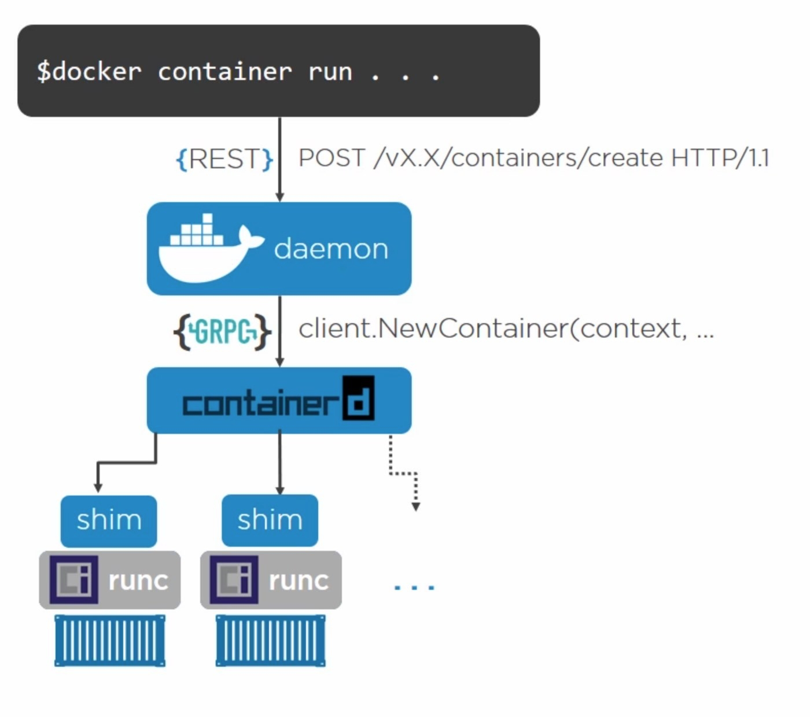

## Dockerfile 最佳实践



1. 什么样的应用【最】适合构建成镜像

- 应用程序以一个或多个进程持续在运行
- 应用进程需是无状态的
  - 可横向扩展的，多个实例角色是等价的，配置是一样的
  - 可宰杀的，多个实例中生病的实例可以被 kill
- 应用程序运行过程中产生的需要持久化数据要存储在后端服务内，例如数据库
- Session 中数据要存储在后端缓存服务内，例如：Redis、Memcached

思考一下这是什么样的应用?

### ---

2. 创建 Docker 镜像

第一步，首先创建 dockerfile

```shell
FROM ubuntu:impish
RUN apt update && apt-get install -y nginx
COPY file1 /var/www/html/
ADD  file2.tar.gz /var/www/html/
EXPOSE 80
CMD ["/usr/sbin/nginx", "-g", "daemon off;"]
```

- FROM：指定容器运行时的基础环境，如：centos:7.9.2009
- ENV：指定容器内的环境变量，如：JAVA_HOME=xxxx
- EXPOSE: 指定容器运行时暴露的端口
- COPY && ADD：向容器内添加文件，注意区别
- RUN：在应用进程启动前需要执行的命令，例如安装工具
- ENTRYPOINT & CMD：启动进程的命令
  - 需要进程在前台运行
  - ENTRYPOINT 是要执行的应用程序，如：/usr/bin/nginx
  - CMD 是应用程序的参数，如：-g daemon off
  - 也可以都写在一起，不推荐

第二步， 构建镜像：docker build

### Build Context

运行 docker build 时，当前目录被称为构建上下文

- 构建上下文中的文件会被传输给 docker deamon
- 构建上下文中没用的文件会造成传输时间长、构建需要资源多

```shell
# ll /root/go/src/github.com/zheng11581/simple-cloudnative/module1/nginx/Dockerfile
# cd /usr
# ls -l
total 100
drwxr-xr-x   2 root root 36864 May 21 18:16 bin
drwxr-xr-x   2 root root  4096 Dec 29 22:20 config
drwxr-xr-x   2 root root  4096 Apr 15  2020 games
drwxr-xr-x   7 root root  4096 Jan 27 12:10 include
drwxr-xr-x  91 root root  4096 Jan 27 17:05 lib
drwxr-xr-x   2 root root  4096 Jul 31  2020 lib32
drwxr-xr-x   2 root root  4096 Dec 29 22:15 lib64
drwxr-xr-x   4 root root  4096 May 14 02:58 libexec
drwxr-xr-x   2 root root  4096 Jul 31  2020 libx32
drwxr-xr-x  10 root root  4096 Dec 29 22:07 local
drwxr-xr-x   2 root root 20480 May 14 02:58 sbin
drwxr-xr-x 122 root root  4096 May 14 02:44 share
drwxr-xr-x   6 root root  4096 Dec 29 22:20 src

# docker build -f /root/go/src/github.com/zheng11581/simple-cloudnative/module1/nginx/Dockerfile -t nginx:bigctx .
Sending build context to Docker daemon 1.258GB
^Control C

# docker build -t nginx:smallctx /root/go/src/github.com/zheng11581/simple-cloudnative/module1/nginx/
Sending build context to Docker daemon  3.584kB
Step 1/6 : FROM ubuntu:impish
 ---> 2dc51e04d744
Step 2/6 : RUN apt update && apt-get install -y nginx
 ---> Using cache
 ---> 3013adfbf428
Step 3/6 : COPY file1 /var/www/html/
 ---> Using cache
 ---> de4df850b665
Step 4/6 : ADD file2.tar.gz /var/www/html/
 ---> Using cache
 ---> bddcc5fd147e
Step 5/6 : EXPOSE 80
 ---> Using cache
 ---> 5e23d73fc62a
Step 6/6 : CMD ["/usr/sbin/nginx", "-g", "daemon off;"]
 ---> Using cache
 ---> e667596cdbd0
Successfully built e667596cdbd0
Successfully tagged nginx:smallctx
```

### Build cache

docker build 会依次执行 Dockerfile 里的命令

FROM|RUN：每条指令会单独一个镜像层，简单的比较命令行字符串，字符串一致则 Using cache
COPY|ADD：每条指令会单独一个镜像层，比较镜像层内文件 checksum，一致则 Using cache（checksum 比较文件内容）
其他命令：不生成镜像层

通过 Overlay FS，将【最新命令】的镜像层叠加为 UpperDir，之前的命令设置为 LowerDir，底层的镜像层变动会导致后面的镜像层缓存失效

```shell
# docker inspect nginx:smallctx
            "Data": {
                "LowerDir": "/var/lib/docker/overlay2/330ce617714bf507e2e00b3921604e914b28c7a530cba223e3725b682bcae273/diff:/var/lib/docker/overlay2/ad73d1fb7c90b470e967201562470b93f5f35c34efe3ff48677b0810450df958/diff:/var/lib/docker/overlay2/e25c9ddb12f1d87cd663d7f5166357c229d61111871c4f8a041dd772159a95fa/diff",
                "MergedDir": "/var/lib/docker/overlay2/ce72661d6ab0d918b1cc0983ff705cf2b54b914b78bdbc8355ad8f49e7a1dd81/merged",
                "UpperDir": "/var/lib/docker/overlay2/ce72661d6ab0d918b1cc0983ff705cf2b54b914b78bdbc8355ad8f49e7a1dd81/diff",
                "WorkDir": "/var/lib/docker/overlay2/ce72661d6ab0d918b1cc0983ff705cf2b54b914b78bdbc8355ad8f49e7a1dd81/work"
            },
```

看到 LowerDir 有 3 个镜像层，有 4 个 FROM|RUN|ADD|COPY 命令，这是因为 file1 和 file2 都是空文件，所以它们内容相同，只需要一个镜像层

### Multi-Stage Build

- docker 多阶段构建：在同一个 Dockerfile 中先定义打包二进制文件，再将打包好的二进制文件添加到镜像中

比如 Maven 项目：
Stage1: copy code to working dir --> mvn package --> got target/app.jar
Stage2: copy jar file from stage1 --> entrypoint is java -jar /app.jar

比如 NPM 项目：
Stage1: copy code to working dir --> npm build --> got dist dir
Stage2: copy dist dir from stage1 --> entrypoint is nginx -g daemon off;

比如 C#项目：
Stage1: copy code to working dir --> dotnet publish --> got app.dll
Stage2: copy dll from stage1 --> entrypoint is dotnet app.dll

```shell

# syntax = docker/dockerfile:experimental
FROM maven:3.8.5-openjdk-8-slim as maven
WORKDIR /discovery-service
COPY . .
RUN --mount=type=cache,target=/root/.m2,rw mvn -B package

FROM azul/zulu-openjdk-alpine
COPY --from=maven /discovery-service/target/discovery-service.jar discovery-service.jar
ENTRYPOINT ["java", "-jar", "/discovery-service.jar"]
EXPOSE 8761

```

- cicd 多步骤构建

后面详细介绍
