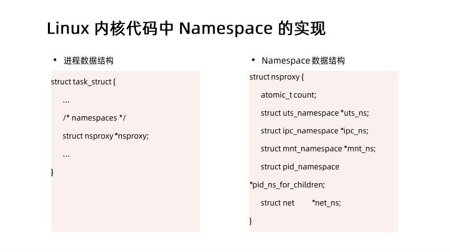
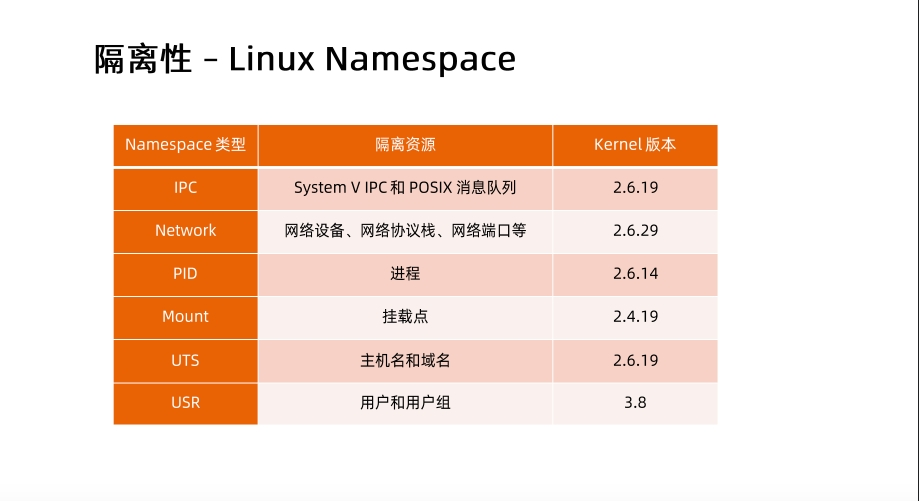
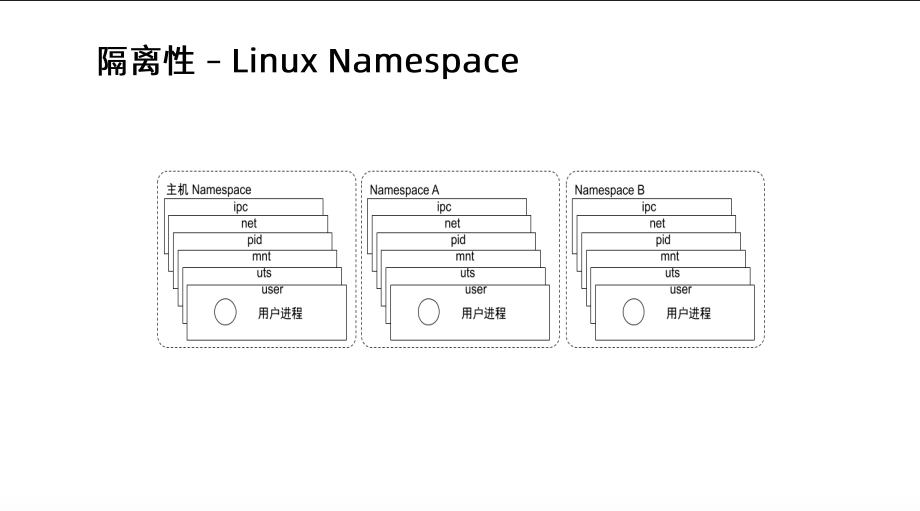
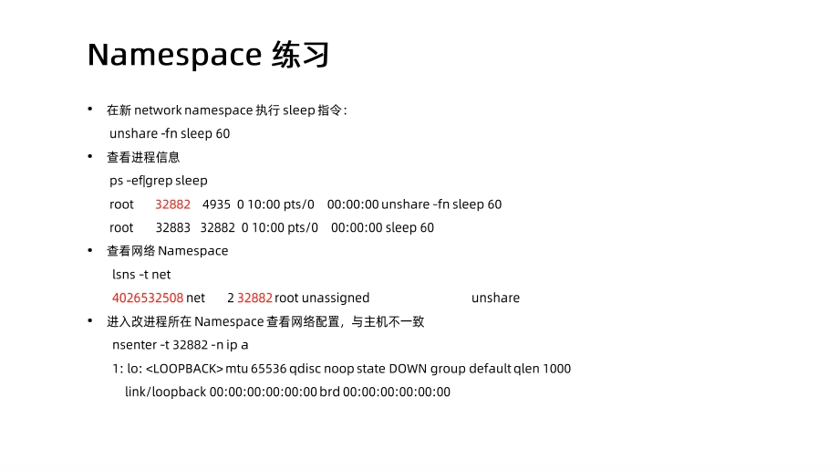
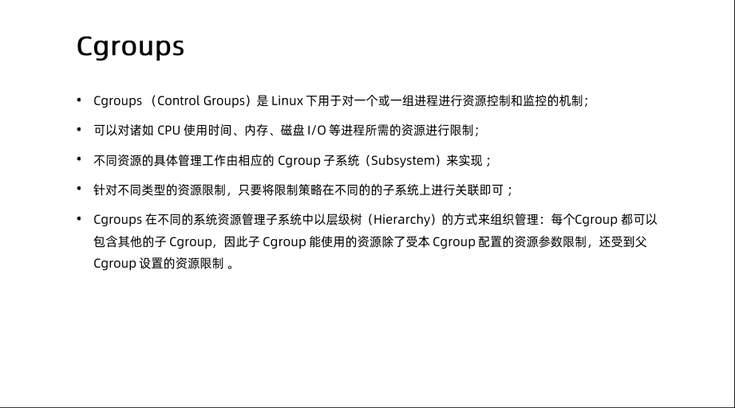
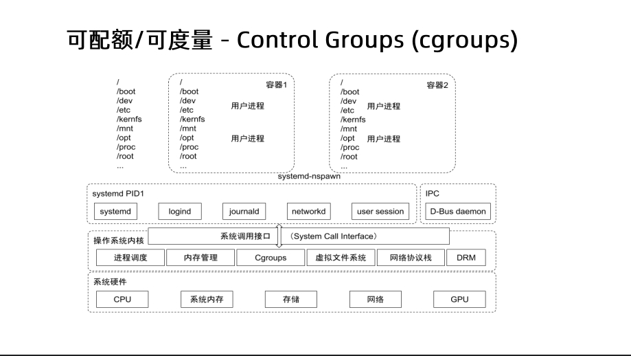
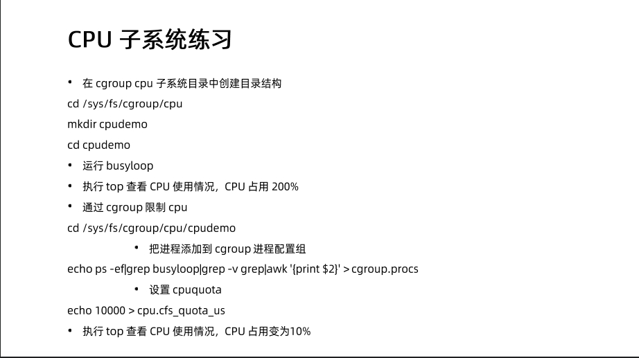

## 模块一：Docker核心技术
### 目标
1. 理解什么是Docker容器
2. Docker的底层技术
3. 将我们的业务容器化，过程需要注意什么

### 什么是Docker容器？
1. 启动一个nginx服务容器看看

```shell
# docker run -d ubuntu/nginx:latest
# ubuntu是镜像仓库的地址
# nginx这个镜像的名字
# latest镜像版本版本

```
2. 自己来做一个 nginx 的镜像

```shell
# cat Dockerfile
FROM ubuntu:impish
RUN apt update && apt-get install -y nginx
COPY file1 /var/www/html/
ADD  file2.tar.gz /var/www/html/
EXPOSE 80
CMD ["/usr/sbin/nginx", "-g", "daemon off;"]
# 它提供了容器中程序执行需要的所有文件

# docker build -t registry/nginx:v1 -f ./Dockerfile . 

# docker images
REPOSITORY       TAG       IMAGE ID       CREATED          SIZE
registry/nginx   v1        e667596cdbd0   28 seconds ago   166MB
ubuntu/nginx     latest    f85d50b56ddd   4 months ago     139MB
ubuntu           impish    2dc51e04d744   6 months ago     77.4MB
```

3. 用自己做的nginx镜像启动一个容器
```shell
# docker run -d registry/nginx:v1

# docker ps
CONTAINER ID   IMAGE               COMMAND                  CREATED          STATUS          PORTS     NAMES
16983ef602cf   registry/nginx:v1   "/usr/sbin/nginx -g …"   15 seconds ago   Up 14 seconds   80/tcp    elastic_wescoff
```

4. 测试一下容器是不是正常工作
- 进入容器中查看nginx服务是不是启动了，配置文件是否正确
- 在容器外部使用curl测试下载文件

```shell
# docker exec 16983ef602cf ps -ef
UID          PID    PPID  C STIME TTY          TIME CMD
root           1       0  0 13:25 ?        00:00:00 nginx: master process nginx -g daemon off;
www-data       7       1  0 13:25 ?        00:00:00 nginx: worker process
www-data       8       1  0 13:25 ?        00:00:00 nginx: worker process
root          23       0  0 13:34 ?        00:00:00 ps -ef

# docker exec 16983ef602cf ls /var/www/html
file1
file2

# docker exec 16983ef602cf ip addr
1: lo: <LOOPBACK,UP,LOWER_UP> mtu 65536 qdisc noqueue state UNKNOWN group default qlen 1000

    link/loopback 00:00:00:00:00:00 brd 00:00:00:00:00:00

    inet 127.0.0.1/8 scope host lo

       valid_lft forever preferred_lft forever

168: eth0@if169: <BROADCAST,MULTICAST,UP,LOWER_UP> mtu 1500 qdisc noqueue state UP group default

    link/ether 02:42:ac:11:00:02 brd ff:ff:ff:ff:ff:ff link-netnsid 0

    inet 172.17.0.2/16 brd 172.17.255.255 scope global eth0

       valid_lft forever preferred_lft forever

# curl -L -O http://172.17.0.2/file2
  % Total    % Received % Xferd  Average Speed   Time    Time     Time  Current
                                 Dload  Upload   Total   Spent    Left  Speed
  0     0    0     0    0     0      0      0 --:--:-- --:--:-- --:--:--     0

# ls
file2 
```
通过这上面的这些操作，估计你已经初步感知到，容器的文件系统是独立的，运行的进程环境是独立的，网络的设置也是独立的.

让进程在一个资源可控的独立环境运行，这就是容器

5. 容器的优点

虚拟机运行状态


容器运行状态


### Docker的底层技术

1. Namespace

Linux系统1号进程时systemd，进程是树状的，根进程是systemd，进程都是由父进程fork、clone出来的

```shell
# ps -ef
UID          PID    PPID  C STIME TTY          TIME CMD
root           1       0  0 May13 ?        00:01:37 /sbin/init
root           2       0  0 May13 ?        00:00:00 [kthreadd]
...
root      253893  253863  0 08:06 ?        00:00:00 nginx: master process /usr/sbin/nginx -g daemon off;
www-data  253928  253893  0 08:06 ?        00:00:00 nginx: worker process
www-data  253929  253893  0 08:06 ?        00:00:00 nginx: worker process
```

在进程被clone出来的时候，数据结构中会指定进程的Namespace




```shell
# docker exec 16983ef602cf ps -ef
UID          PID    PPID  C STIME TTY          TIME CMD
root           1       0  0 08:06 ?        00:00:00 nginx: master process /usr/sbin/nginx -g daemon off;
www-data       7       1  0 08:06 ?        00:00:00 nginx: worker process
www-data       8       1  0 08:06 ?        00:00:00 nginx: worker process
root          21       0  0 08:09 ?        00:00:00 ps -ef


# ps -ef | grep nginx
UID        PID  PPID  C STIME TTY          TIME CMD
root      253893  253863  0 08:06 ?        00:00:00 nginx: master process /usr/sbin/nginx -g daemon off;
www-data  253928  253893  0 08:06 ?        00:00:00 nginx: worker process
www-data  253929  253893  0 08:06 ?        00:00:00 nginx: worker process
root      254370  247230  0 08:09 pts/1    00:00:00 grep --color=auto nginx

```

HOST PID Namespace  -> CONTAINER PID Namespace不一样，有对应关系
```text
253893 -> 1
253928 -> 7
253929 -> 8
```

除了PID namespace外还有：UTS USR Mount Network IPC 





对Namespace的操作

#### 查看当前操作系统的Namspace

```shell
# lsns -t net
        NS TYPE NPROCS    PID USER    NETNSID NSFS                           COMMAND
4026531992 net     111      1 root unassigned                                /sbin/init
4026532191 net       1    534 root unassigned                                /usr/sbin/haveged --Foreground --verbose=1 -w 1024
4026532257 net       3 253893 root          0 /run/docker/netns/fbcce4656316 nginx: master process /usr/sbin/nginx -g daemon off;
```

#### 查看某进程的Namespace

```shell
# ls -la /proc/253893/ns/
total 0
dr-x--x--x 2 root root 0 May 14 08:06 .
dr-xr-xr-x 9 root root 0 May 14 08:06 ..
lrwxrwxrwx 1 root root 0 May 14 09:17 cgroup -> 'cgroup:[4026531835]'
lrwxrwxrwx 1 root root 0 May 14 08:07 ipc -> 'ipc:[4026532254]'
lrwxrwxrwx 1 root root 0 May 14 08:07 mnt -> 'mnt:[4026532252]'
lrwxrwxrwx 1 root root 0 May 14 08:06 net -> 'net:[4026532257]'
lrwxrwxrwx 1 root root 0 May 14 08:07 pid -> 'pid:[4026532255]'
lrwxrwxrwx 1 root root 0 May 14 09:27 pid_for_children -> 'pid:[4026532255]'
lrwxrwxrwx 1 root root 0 May 14 09:17 user -> 'user:[4026531837]'
lrwxrwxrwx 1 root root 0 May 14 08:07 uts -> 'uts:[4026532253]'
```

#### 进入某Namespace执行命令

```shell
# nsenter -t 253893 -n ip add
1: lo: <LOOPBACK,UP,LOWER_UP> mtu 65536 qdisc noqueue state UNKNOWN group default qlen 1000
    link/loopback 00:00:00:00:00:00 brd 00:00:00:00:00:00
    inet 127.0.0.1/8 scope host lo
       valid_lft forever preferred_lft forever
23: eth0@if24: <BROADCAST,MULTICAST,UP,LOWER_UP> mtu 1500 qdisc noqueue state UP group default
    link/ether 02:42:ac:11:00:02 brd ff:ff:ff:ff:ff:ff link-netnsid 0
    inet 172.17.0.2/16 brd 172.17.255.255 scope global eth0
       valid_lft forever preferred_lft forever
```

#### Namespace练习



2. Cgroup

Namaspace解决进程之间的隔离，Cgroup用于解决进程资源的限制





内核会把Cgroup子系统挂载到/sys/fs/cgroup下

#### CPU subsystem
```text
cpu.shares：在满载的情况下，配置CPU使用时间的相对值
cpu.cfs_period_us：配置CPU时间周期长度，单位us
cpu.cfs_quota_us：配置CPU最大使用时间，单位us
例如：
1. CGroup A：cpu.cfs_quota_us=50000，cfs_period_us=100000，那么Cgroup A最大可以使用50000/100000=0.5个CPU，即最大CPU使用率是50%
2. CGroup A：cpu.shares=2048，CGroup B：cpu.shares=1024，那么在主机满载情况下，Cgroup A最大可以使用2/3的CPU，Cgroup B最大可以使用1/3的CPU
```

Cgroup CPU子系统练习：



#### Memory subsystem

#### Blockio subsystem


3. Union FS

### Dockerfile最佳实践