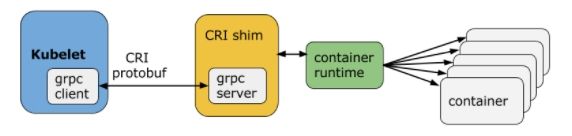
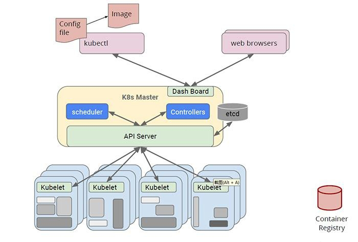
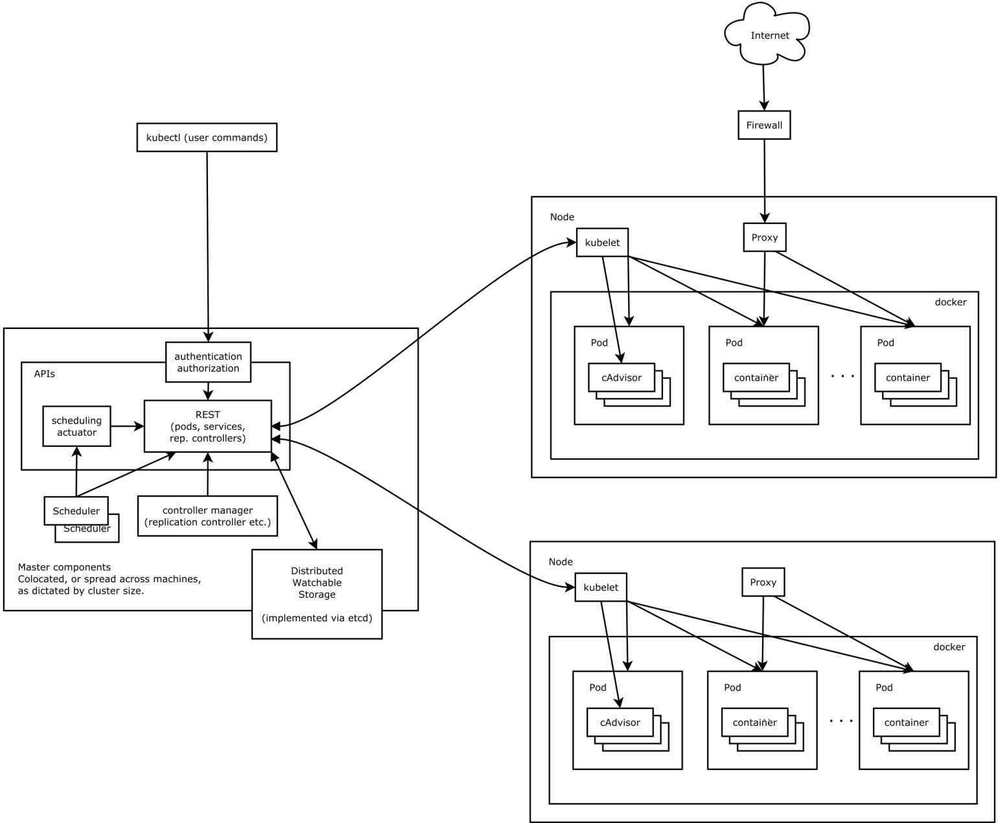
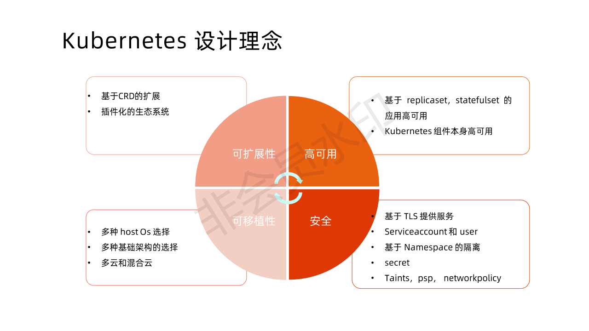
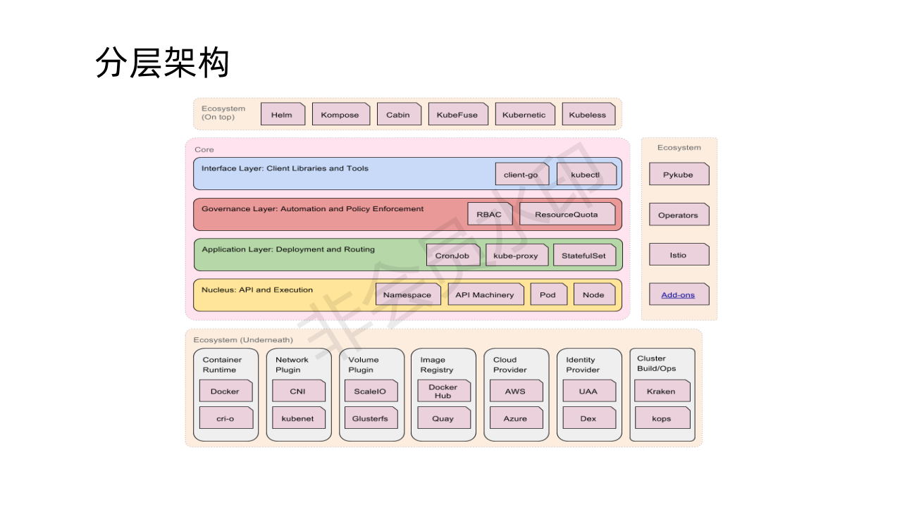
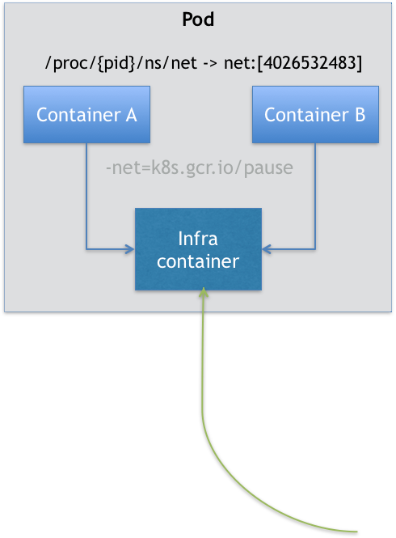

## 模块二：Kubernetes基础架构和对象

### 什么是Kubernetes?

Kubernetes是谷歌开源的容器集群管理系统，是Google多年大规模容器管理技术Borg的开源版本，主要功能包括∶
- 基于容器的应用部署、维护和滚动升级；



- 负载均衡和服务发现；
- 跨机器和跨地区的集群调度；
- 自动伸缩；
- 无状态服务和有状态服务；
- 插件机制保证扩展性。

### Kubernetes基础架构

Kubernetes分布式架构


分布式组件的功能


控制平面（Master Node）
- API服务器（APIServer）：这是Kubernetes控制面板中唯一带有用户可访问API以及用户可交互的组件。API服务器会暴露一个RESTful的Kubernetes API并使用JSON格式的清单文件（manifest files)
- 集群的数据存储（Cluster Data Store）：Kubernetes 使用"etcd"。这是一个强大的、稳定的、高可用的键值存储，被Kubernetes用于持久储存所有的 API对象
- 控制管理器（Controller Manager）：被称为"kube-controller manager"，它运行着所有处理集群日常任务的控制器。包括了节点控制器、副本控制器、端点（endpoint）控制器以及服务账户等
- 调度器（Scheduler）：调度器会监控新建的 pods（一组或一个容器）并将其分配给节点

数据平面（Worker Node）

- Kubelet：负责调度到对应节点的 Pod 的生命周期管理，执行任务并将 Pod 状态报告给主节点的渠道，通过容器运行时（拉取镜像、启动和停止容器等）来运行这些容器。它还会定期执行被请求的容器的健康探测程序
- Kube-proxy：它负责节点的网络，在主机上维护网络规则并执行连接转发。它还负责对正在服务的 pods进行负载平衡。

推荐的 Add-ons

- kube-dns：负责为整个集群提供 DNS服务;
- Ingress Controller：为服务提供外网入口;
- MetricsServer：提供资源监控;
- Dashboard：提供GUI;
- Fluentd-Elasticsearch：提供集群日志采集、存储与查询。


### Kubernetes的架构原则





- 核心层：Kubernetes最核心的功能。对外提供API构建高层应用；对内提供插件式应用的执行环境
- 应用层：提供部署（无状态应用、有状态应用、批处理任务、集群应用等）和路由（服务发现、DNS解析等）的能力
- 管理层：提供自动化（动态扩展）、策略管理（RBAC、Quota、PSP、NetworkPolicy）能力
- 接口层：Kubectl命令行工具、客户端SDK、集群联邦
- 生态系统：分为两个范畴
  - Kubernetes外部：日志、监控、ServiceMesh、配置管理、CICD等
  - Kubernetes内部：CRI、CNI、CSI、镜像仓库、Cloud Provider、集群自身的配置和管理

### Kubernetes的对象设计原则

- 所有API对象都是声明式的


- API对象是彼此互补而且可组合的
高内聚，松耦合

- 高层API是以操作意图为基础设计
Kubernetes的高层API设计，一定是以Kubernetes的业务为基础出发，也就是以系统调度管理容器的操作意图为基础设计

- 底层API根据高层API的控制需要设计
设计实现低层API的目的，是为了被高层API使用，考虑减少冗余、提高重用性的目的，低层API的设计也要以需求为基础

- 底层API不要有在高层API无法显式知道的内部隐藏机制
例如StatefulSet和ReplicaSet，本来就是两种Pod集合，那么Kubernetes就用不同API对象来定义它们，而不会说只用同一个ReplicaSet，内部通过特殊的算法再来区分这个ReplicaSet是有状态的还是无状态

### Kubernetes核心对象

- Pod API

#### 为什么需要Pod：成组调度

二进制部署: 进程 -> 虚拟机 -> CentOS/Ubuntu -> 宿主机
容器化部署：容器 -> Pod    ->  Kubernetes   -> 宿主机

```shell
# pstree -g

systemd(1)-+-accounts-daemon(1984)-+-{gdbus}(1984)
           | `-{gmain}(1984)
           |-acpid(2044)
          ...      
           |-lxcfs(1936)-+-{lxcfs}(1936)
           | `-{lxcfs}(1936)
           |-mdadm(2135)
           |-ntpd(2358)
           |-polkitd(2128)-+-{gdbus}(2128)
           | `-{gmain}(2128)
           |-rsyslogd(1632)-+-{in:imklog}(1632)
           |  |-{in:imuxsock) S 1(1632)
           | `-{rs:main Q:Reg}(1632)
           |-snapd(1942)-+-{snapd}(1942)
           |  |-{snapd}(1942)
           |  |-{snapd}(1942)
           |  |-{snapd}(1942)
           |  |-{snapd}(1942)
```
Linux 系统里的进程不是孤苦伶仃的，是以进程组的方式进行组合，例如：rsyslogd它负责的是 Linux 操作系统里的日志处理。可以看到，rsyslogd 的主程序 main，和它要用到的内核日志模块 imklog 等，同属于 1632 进程组。这些进程相互协作，共同完成 rsyslogd 程序的职责。

Kubernetes就是把这种进程组的概念映射到容器技术中形成Pod的概念（容器组）统一调度，用来解决成组调度的问题

#### Pod的实现
Pod是一组共享了某些资源的容器，Pod里的所有容器，共享的是同一个 Network Namespace，并且可以声明共享同一个 Volume，它只是一个逻辑概念



Infra 容器一定要占用极少的资源，所以它使用的是一个非常特殊的镜像，叫作：k8s.gcr.io/pause。这个镜像是一个用汇编语言编写的、永远处于“暂停”状态的容器，不会退出，解压后的大小也只有 100~200 KB 左右

#### 为什么需要Pod：容器设计模式

[Two Containers](./yamls/pod/container/two-containers.MD)

A B两个容器进程实际上是有“超亲密关系”的，他们需要通过文件系统进行通信，还有以下“超亲密关系”：

- 它们可以直接使用 localhost 进行通信；
- 它们看到的网络设备跟 Infra 容器看到的完全一样；
- 一个 Pod 只有一个 IP 地址，也就是这个 Pod 的 Network Namespace 对应的 IP 地址；
- 当然，其他的所有网络资源，都是一个 Pod 一份，并且被该 Pod 中的所有容器共享；
- Pod 的生命周期只跟 Infra 容器一致，而与容器 A 和 B 无关。

#### Pod API对象的分解

首先先看一下所有API对象共性的东西：pkg/apis/core/types.go

- TypeMeta
  - Group
  - Kind
  - Version

- ObjectMeta
  - Name
  - [Namespace：隔离API对象、做资源隔离](./yamls/namespace/namespace-quota.MD)
  - [Labels：给对象打标签，可以做filter/selector](./yamls/selector/labels.MD)
  - Annotations
  - ...

- Spec：各种规格属性，定义各个对象的主要区别在这里

- Status：对象的运行状态（不需要自己管理）

PodSpec详解

- 容器运行时相关

```golang
// PodSpec is a description of a pod.
type PodSpec struct {
  InitContainers []Container `json:"initContainers,omitempty" patchStrategy:"merge" patchMergeKey:"name" protobuf:"bytes,20,rep,name=initContainers"`
  Containers []Container `json:"containers" patchStrategy:"merge" patchMergeKey:"name" protobuf:"bytes,2,rep,name=containers"`
  EphemeralContainers []EphemeralContainer `json:"ephemeralContainers,omitempty" patchStrategy:"merge" patchMergeKey:"name" protobuf:"bytes,34,rep,name=ephemeralContainers"`
  Volumes []Volume `json:"volumes,omitempty" patchStrategy:"merge,retainKeys" patchMergeKey:"name" protobuf:"bytes,1,rep,name=volumes"`
  ImagePullSecrets []LocalObjectReference `json:"imagePullSecrets,omitempty" patchStrategy:"merge" patchMergeKey:"name" protobuf:"bytes,15,rep,name=imagePullSecrets"`
  RuntimeClassName *string `json:"runtimeClassName,omitempty" protobuf:"bytes,29,opt,name=runtimeClassName"`
  ...
}
```

[InitContainers](./yamls/pod/container/2-initcontainer.MD)

[EphemeralContainers](./yamls/pod/container/3-ephemeral-container.MD)

[Volumes](./yamls/pod/persistentvolume/volumes.MD)

[ImagePullSecrets](./yamls/pod/imageregistry/5-image-pull.MD)


- 生命周期（健康检查）相关

```golang
// PodSpec is a description of a pod.
type PodSpec struct {
  RestartPolicy RestartPolicy `json:"restartPolicy,omitempty" protobuf:"bytes,3,opt,name=restartPolicy,casttype=RestartPolicy"`
  ReadinessGates []PodReadinessGate `json:"readinessGates,omitempty" protobuf:"bytes,28,opt,name=readinessGates"`
  TerminationGracePeriodSeconds *int64 `json:"terminationGracePeriodSeconds,omitempty" protobuf:"varint,4,opt,name=terminationGracePeriodSeconds"`
  ...
}

// A single application container that you want to run within a pod.
type Container struct {
	LivenessProbe *Probe `json:"livenessProbe,omitempty" protobuf:"bytes,10,opt,name=livenessProbe"`
	ReadinessProbe *Probe `json:"readinessProbe,omitempty" protobuf:"bytes,11,opt,name=readinessProbe"`
	StartupProbe *Probe `json:"startupProbe,omitempty" protobuf:"bytes,22,opt,name=startupProbe"`
  Lifecycle *Lifecycle `json:"lifecycle,omitempty" protobuf:"bytes,12,opt,name=lifecycle"`
}

```

[RestartPolicy](./yamls/pod/lifecycle/6-restartpolicy.MD)

[StartupProbe]()

[LivenessProbe](./yamls/pod/lifecycle/7-graceful-start.MD#2-liveness-probe)

[RedinessProbe](./yamls/pod/lifecycle/7-graceful-start.MD#1-rediness-probe)

[Lifecycle-postStart](./yamls/pod/lifecycle/7-graceful-start.MD#3-lifecycle-poststart)

[ReadinessGates](./yamls/pod/lifecycle/7-graceful-start.MD#4-rediness-gate)

[Lifecycle-preStop](./yamls/pod/lifecycle/graceful-stop/8-prestop.yaml)

[TerminationGracePeriodSeconds](./yamls/pod/lifecycle/graceful-stop/8-termination-graceful.yaml)


- 调度相关

```golang
// PodSpec is a description of a pod.
type PodSpec struct {
  NodeSelector map[string]string `json:"nodeSelector,omitempty" protobuf:"bytes,7,rep,name=nodeSelector"`
  NodeName string `json:"nodeName,omitempty" protobuf:"bytes,10,opt,name=nodeName"`
  Subdomain string `json:"subdomain,omitempty" protobuf:"bytes,17,opt,name=subdomain"`
  Affinity *Affinity `json:"affinity,omitempty" protobuf:"bytes,18,opt,name=affinity"`
  SchedulerName string `json:"schedulerName,omitempty" protobuf:"bytes,19,opt,name=schedulerName"`
  Tolerations []Toleration `json:"tolerations,omitempty" protobuf:"bytes,22,opt,name=tolerations"`
  PriorityClassName string `json:"priorityClassName,omitempty" protobuf:"bytes,24,opt,name=priorityClassName"`
  Priority *int32 `json:"priority,omitempty" protobuf:"bytes,25,opt,name=priority"`
  TopologySpreadConstraints []TopologySpreadConstraint `json:"topologySpreadConstraints,omitempty" patchStrategy:"merge" patchMergeKey:"topologyKey" protobuf:"bytes,33,opt,name=topologySpreadConstraints"`
  PreemptionPolicy *PreemptionPolicy `json:"preemptionPolicy,omitempty" protobuf:"bytes,31,opt,name=preemptionPolicy"`
  Overhead ResourceList `json:"overhead,omitempty" protobuf:"bytes,32,opt,name=overhead"`

  ...
}
```

[NodeSelector](./yamls/pod/schedule/nodeselector/9-nodeselector.MD)

[Affinity-NodeAffinity & NodeAntiAffinity](./yamls/pod/schedule/affinity/10-nodeaffinity.MD)

[Affinity-PodAffinity & PodAntiAffinity](./yamls/pod/schedule/affinity/11-podaffinity.MD)

[Tolerations]()

- 网络与安全相关

```golang
// PodSpec is a description of a pod.
type PodSpec struct {
  DNSPolicy DNSPolicy `json:"dnsPolicy,omitempty" protobuf:"bytes,6,opt,name=dnsPolicy,casttype=DNSPolicy"`
  DeprecatedServiceAccount string `json:"serviceAccount,omitempty" protobuf:"bytes,9,opt,name=serviceAccount"`
	AutomountServiceAccountToken *bool `json:"automountServiceAccountToken,omitempty" protobuf:"varint,21,opt,name=automountServiceAccountToken"`
  HostNetwork bool `json:"hostNetwork,omitempty" protobuf:"varint,11,opt,name=hostNetwork"`
  HostPID bool `json:"hostPID,omitempty" protobuf:"varint,12,opt,name=hostPID"`
  HostIPC bool `json:"hostIPC,omitempty" protobuf:"varint,13,opt,name=hostIPC"`
  ShareProcessNamespace *bool `json:"shareProcessNamespace,omitempty" protobuf:"varint,27,opt,name=shareProcessNamespace"`
  SecurityContext *PodSecurityContext `json:"securityContext,omitempty" protobuf:"bytes,14,opt,name=securityContext"`
  Hostname string `json:"hostname,omitempty" protobuf:"bytes,16,opt,name=hostname"`
  HostAliases []HostAlias `json:"hostAliases,omitempty" patchStrategy:"merge" patchMergeKey:"ip" protobuf:"bytes,23,rep,name=hostAliases"`
  DNSConfig *PodDNSConfig `json:"dnsConfig,omitempty" protobuf:"bytes,26,opt,name=dnsConfig"`
  RuntimeClassName *string `json:"runtimeClassName,omitempty" protobuf:"bytes,29,opt,name=runtimeClassName"`
  EnableServiceLinks *bool `json:"enableServiceLinks,omitempty" protobuf:"varint,30,opt,name=enableServiceLinks"`
  SetHostnameAsFQDN *bool `json:"setHostnameAsFQDN,omitempty" protobuf:"varint,35,opt,name=setHostnameAsFQDN"`
  OS *PodOS `json:"os,omitempty" protobuf:"bytes,36,opt,name=os"`
  
  ...
}
```


- Controller API
  - ReplicaSet 
  - Deployment
  - StatefulSet
  - DaemonSet
  - Job
  - CronJob