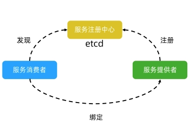
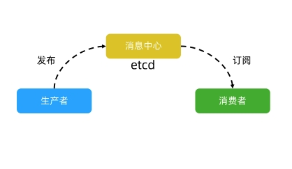
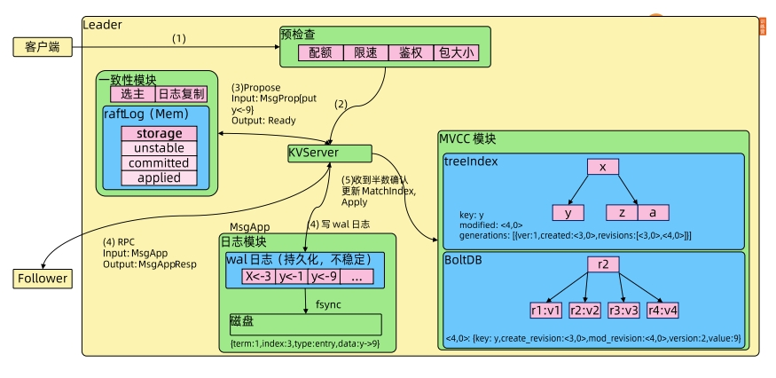

## 模块二：Kubernetes架构原则和对象设计原则

### 什么是Kubernetes?

Kubernetes是谷歌开源的容器集群管理系统，是Google多年大规模容器管理技术Borg的开源版本，主要功能包括∶
- 基于容器的应用部署、维护和滚动升级；


- 负载均衡和服务发现；
- 跨机器和跨地区的集群调度；
- 自动伸缩；
- 无状态服务和有状态服务；
- 插件机制保证扩展性。

### Kubernetes基本组件

Kubernetes分布式架构


分布式组件的功能


控制平面（Master Node）
- API服务器（APIServer）：这是Kubernetes控制面板中唯一带有用户可访问API以及用户可交互的组件。API服务器会暴露一个RESTful的Kubernetes API并使用JSON格式的清单文件（manifest files)
- 集群的数据存储（Cluster Data Store）：Kubernetes 使用"etcd"。这是一个强大的、稳定的、高可用的键值存储，被Kubernetes用于持久储存所有的 API对象
- 控制管理器（Controller Manager）：被称为"kube-controller manager"，它运行着所有处理集群日常任务的控制器。包括了节点控制器、副本控制器、端点（endpoint）控制器以及服务账户等
- 调度器（Scheduler）：调度器会监控新建的 pods（一组或一个容器）并将其分配给节点

数据平面（Worker Node）

- Kubelet：负责调度到对应节点的 Pod 的生命周期管理，执行任务并将 Pod 状态报告给主节点的渠道，通过容器运行时（拉取镜像、启动和停止容器等）来运行这些容器。它还会定期执行被请求的容器的健康探测程序
- Kube-proxy：它负责节点的网络，在主机上维护网络规则并执行连接转发。它还负责对正在服务的 pods进行负载平衡。

推荐的 Add-ons

- kube-dns：负责为整个集群提供 DNS服务;
- Ingress Controller：为服务提供外网入口;
- MetricsServer：提供资源监控;
- Dashboard：提供GUI;
- Fluentd-Elasticsearch：提供集群日志采集、存储与查询。

### ETCD

安装

```shell
ETCD_VER=v3.5.4

# choose either URL
GOOGLE_URL=https://storage.googleapis.com/etcd
GITHUB_URL=https://github.com/etcd-io/etcd/releases/download
DOWNLOAD_URL=${GITHUB_URL}

rm -f /tmp/etcd-${ETCD_VER}-linux-amd64.tar.gz
rm -rf /tmp/etcd-download-test && mkdir -p /tmp/etcd-download-test

curl -L ${DOWNLOAD_URL}/${ETCD_VER}/etcd-${ETCD_VER}-linux-amd64.tar.gz -o /tmp/etcd-${ETCD_VER}-linux-amd64.tar.gz
tar xzvf /tmp/etcd-${ETCD_VER}-linux-amd64.tar.gz -C /tmp/etcd-download-test --strip-components=1
rm -f /tmp/etcd-${ETCD_VER}-linux-amd64.tar.gz

/tmp/etcd-download-test/etcd --version
/tmp/etcd-download-test/etcdctl version
/tmp/etcd-download-test/etcdutl version
```

使用场景

- 基本的key-value存储

```shell
# etcdctl member list--write-out=table
+------------------+---------+---------+-----------------------+-----------------------+------------+
|        ID        | STATUS  |  NAME   |      PEER ADDRS       |     CLIENT ADDRS      | IS LEARNER |
+------------------+---------+---------+-----------------------+-----------------------+------------+
| 8e9e05c52164694d | started | default | http://localhost:2380 | http://localhost:2379 |      false |
+------------------+---------+---------+-----------------------+-----------------------+------------+
# etcdctl put x 0
OK
# etcdctl get x 
x
0
```

- 服务注册与发现



- 基于监听机制的分布式系统



重要原理

- etcd 基于Raft的一致性
  - Leader Election
  - Log Relication

- 安全性
  - 选举安全性：每个Term只能选举出一个Leader
  - Leader完整性：只有Term较大，Index较大的Cadidate可以当选

- 失效处理
  - Leader失效：恢复后会成为Follower，并被新的Leader数据覆盖
  - Follower不可用：恢复后继续作为Follower，同步Leader数据
  - 多个Candidate：随机一个Leader Election timeout（150~300ms），重新发起投票

- wal日志



- Watch机制


### Kubernetes的架构原则

### Kubernetes的对象设计原则

### Kubernetes核心对象