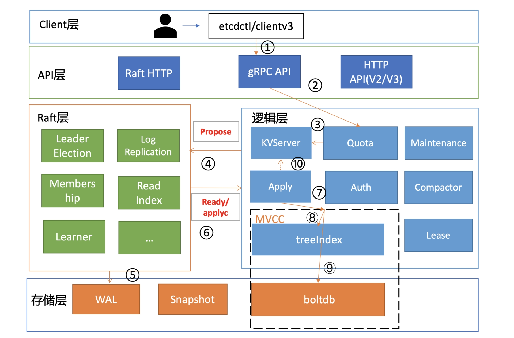

### ETCD（自行了解）

安装

```shell
ETCD_VER=v3.5.4

# choose either URL
GOOGLE_URL=https://storage.googleapis.com/etcd
GITHUB_URL=https://github.com/etcd-io/etcd/releases/download
DOWNLOAD_URL=${GITHUB_URL}

rm -f /tmp/etcd-${ETCD_VER}-linux-amd64.tar.gz
rm -rf /tmp/etcd-download-test && mkdir -p /tmp/etcd-download-test

curl -L ${DOWNLOAD_URL}/${ETCD_VER}/etcd-${ETCD_VER}-linux-amd64.tar.gz -o /tmp/etcd-${ETCD_VER}-linux-amd64.tar.gz
tar xzvf /tmp/etcd-${ETCD_VER}-linux-amd64.tar.gz -C /tmp/etcd-download-test --strip-components=1
rm -f /tmp/etcd-${ETCD_VER}-linux-amd64.tar.gz

/tmp/etcd-download-test/etcd --version
/tmp/etcd-download-test/etcdctl version
/tmp/etcd-download-test/etcdutl version
```

使用场景

- 基本的key-value存储

```shell
# etcdctl member list--write-out=table
+------------------+---------+---------+-----------------------+-----------------------+------------+
|        ID        | STATUS  |  NAME   |      PEER ADDRS       |     CLIENT ADDRS      | IS LEARNER |
+------------------+---------+---------+-----------------------+-----------------------+------------+
| 8e9e05c52164694d | started | default | http://localhost:2380 | http://localhost:2379 |      false |
+------------------+---------+---------+-----------------------+-----------------------+------------+
# etcdctl put x 0
OK
# etcdctl get x 
x
0
```

- 服务注册与发现

- 基于监听机制的分布式系统

重要原理

- 基于Raft的一致性
  - http://thesecretlivesofdata.com/raft/   
  - Leader Election
  - Log Relication

- 基于Raft的安全性
  - 选举安全性：每个Term只能选举出一个Leader
  - Leader完整性：只有Term较大，Index较大的Cadidate可以当选

- 基于Raft的失效处理
  - Leader失效：恢复后会成为Follower，并被新的Leader数据覆盖
  - Follower不可用：恢复后继续作为Follower，同步Leader数据
  - 多个Candidate：随机一个Leader Election timeout（150~300ms），重新发起投票

- WAL日志



- Watch机制
