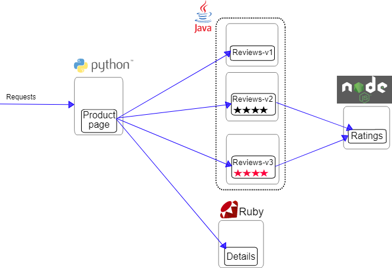

## Bookinfo Application 



- The `productpage` microservice calls the `details` and `reviews` microservices to populate the page.
- The `details` microservice contains book information.
- The `reviews` microservice contains book reviews. It also calls the `ratings` microservice.
- The `ratings` microservice contains book ranking information that accompanies a book review.

- There are 3 versions of the `reviews` microservice:
    - Version v1 doesn’t call the `ratings` service.
    - Version v2 calls the `ratings` service, and displays each rating as 1 to 5 `black stars`.
    - Version v3 calls the `ratings` service, and displays each rating as 1 to 5 `red stars`.

### Deploying the application

```shell
# kubectl create ns bookinfo
# kubectl apply -f samples/bookinfo/platform/kube/bookinfo.yaml -n bookinfo
# kubectl get pod -n bookinfo
```